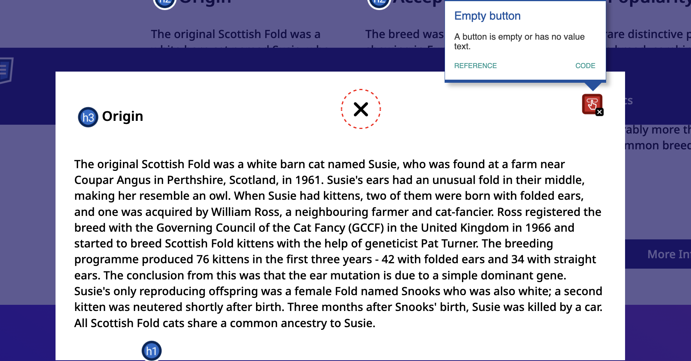

# Debugging Exercise

## Debugging and Code Review

This debugging exercise involves testing a website and reviewing its code to uncover bugs, issues, and other potential problems.

Take a look the [sample-website](./sample-website/) folder, which contains code written by Yiming Lin, a longtime TA for this course, in 2023. Since then, I have made some changes to the website, including the added fetch() call. There are several issues in the code you were given, ranging from code correctness to semantics to wrong implementations. There are also optimizations that you can make to the code.

As you review the code, you should aim to find as many significant issues as possible. For full credit, you need to find and document two issues, and any issue you document must be based on what we learned in this class. Not every issue in this codebase will count as a significant issue. Some examples of things that will not count as significant issues are: fixing a typo, renaming a class, etc.

## What is a Code Review?

A code review is an opportunity to check and debug someone else’s code before it is merged into the main branch for the codebase. Code reviews are typically performed by developers other than the author of the code. THe goal of a code review is to help ensure the code functions as intended and does not introduce new bugs or issues into the codebase.

## Completing the Code Review

In the [code-review.md](./code-review.md) file, document each issue you identify during your code review. You should describe the issue, explain why it is an issue, and write up the code for the solution. An example issue and solution are provided below.

For full credit, find and document two issues. Any issue you document must be based on what we learned in this class.

## Code Review Example

### Issue #1: Accessibility

The issue, why this is an issue, and the solution:

The accessibility issue is the "empty button" issue, meaning that the button is either empty or has no text value text. A button should always have a value, but sometimes, we might use a glyphicon such as "x" to indicate this button is meant to close the modal. To fix this issue, we can add an "aria-label" attribute. It's also a good idea to add the "title" attribute, which will show the "title" of the image as a tooltip when the user hovers over the image.



Initial code:

```html
<button class="close-popup-button">
  <i class="fa-solid fa-xmark"></i>
</button>
```

Updated code:

```html
<button
  class="close-popup-button"
  title="close popup button"
  aria-label="close popup button"
>
  <i class="fa-solid fa-xmark"></i>
</button>
```
